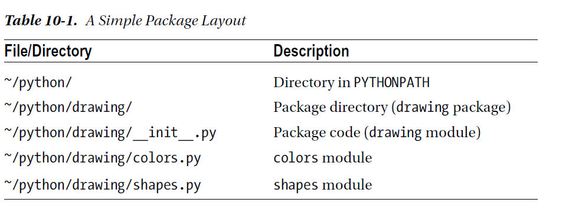
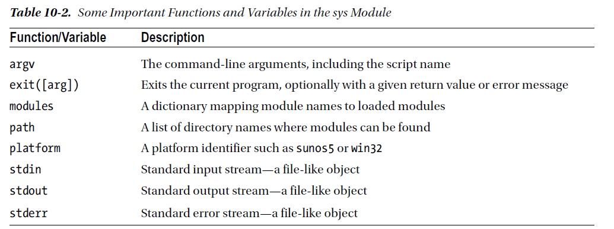
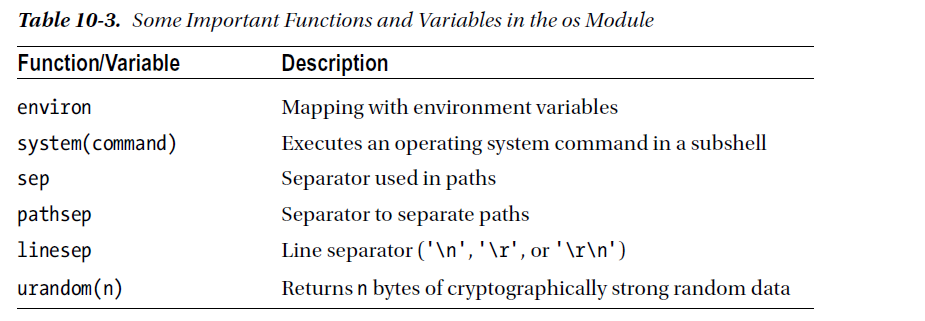
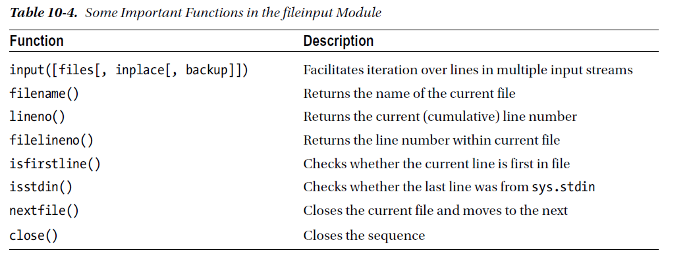

chapter 10: Batteries Included
==================================
지금까지 파이썬의 대부분을 알아보았다.
그것 자체만으로 막강한 힘을 가지지만 파이썬은 좀더 다룰 수 있는 툴을 제공한다.
표준 인스톨 버젼은 표준 라이브러리라고 불리는 모듈을 포함한다.
당신은 그것들을 봐왔다.(math,cmath)
이장에서는 어떻게 모듈이 동작하고 그것을 탐색하며 무엇을 제공할지 배운다.
이 장은 선택된 유용한 모듈을 중심으로 스탠다드 라이브러리에 대한 오버뷰를 제공한다.

10.1 Modules
-------------------
이미 당신의 프로그램을 만드는 것을 알고 있다.
import라는 외부 모듈로부터 당신 프로그램에 넣을 수 있다.

.. code-block:: python

    >>> import math
    >>> math.sin(0)

Modules Are Programs
~~~~~~~~~~~~~~~~~~~~~~

.. code-block:: python

    Listing 10-1. A Simple Module
    # hello.py
    print("Hello, world!")

저장하는것은 중요한 것이다.다음에서 window 또는 unix에 저장하는 것을 알아보자.

.. code-block:: python

    import sys
    sys.path.append('D:/down3')

    import hello

    >>> import importlib
    >>> hello = importlib.reload(hello)

Modules Are Used to Define Things
~~~~~~~~~~~~~~~~~~~~~~~~~~~~~~~~~~~~
모듈은 당신의 프로그램으로 import 되어질 처음에 실행된다.
이것은 유용하다.그러나 아주 유용하지는 않다.
그것들을 의미있게 만드는것은 이후에 그 값을 유지하는 것이다.
그것은 당신이 정의한 어떤 클래스나 함수들,값을 할당하는 변수들이 모듈의 특성이 된다는 것이다.
이것은 좀 복잡할지 모르겠지만, 아주 단순하다.

Defining a Function in a Module
~~~~~~~~~~~~~~~~~~~~~~~~~~~~~~~~
다음 예를 보자.

.. code-block:: python

    def hello():
        print("Hello, world!")

    # import hello2.py
    import hello2
    hello2.hello()

Adding Test Code in a Module
~~~~~~~~~~~~~~~~~~~~~~~~~~~~~~~

.. code-block:: python

    # hello3.py
    def hello():
    print("Hello, world!")
    # A test:
    hello()
    >>> import hello3
    Hello, world!
    >>> hello3.hello()
    Hello, world!

다음 예제를 보자.

.. code-block:: python

    # hello4.py
    def hello():
        print("Hello, world!")

    def test():
        hello()

    if __name__ == '__main__': test()

    >>> import hello4
    >>> hello4.hello()
    hello4.test()

Making Your Modules Available
~~~~~~~~~~~~~~~~~~~~~~~~~~~~~~~

Putting Your Module in the Right Place
~~~~~~~~~~~~~~~~~~~~~~~~~~~~~~~~~~~~~~~~
다음 예제를 보자.

.. code-block:: python

    >>> import sys, pprint
    >>> pprint.pprint(sys.path)

위에서 알 수 있듯이 python path의 site-package 안에 다른 이름으로 넣어도 인식이 가능하다.

.. code-block:: python

    >>> import another_hello
    >>> another_hello.hello()

Telling the Interpreter Where to Look
~~~~~~~~~~~~~~~~~~~~~~~~~~~~~~~~~~~~~~~
올바른 위치에 당신의 모듈을 넣는것은 몇가지 이유로 좋은 솔루션이 아닐 수 있다.

- 당신은 당신의 모듈을 인터프리터가 있는 디렉토리에 산만하게 있길 원하지 않는다.
- 파이썬 인터프리터 디렉토리에 저장하도록 허락하지 않을 것이다.
- 당신의 모듈을 어떤곳에 놓고 싶어할것이다.

당신의 모듈을 특정한 위치에 놓고자 하면 인터프리터에게 그 곳의 위치를 알려줘야 한다.
sys.path로 직접적으로 알려주는 방법도 있지만 그렇게 하는것은 일반적이지 않다.
일반적으로 PYTHONPATH 에 모듈 디렉토리를 포함시키는 것이다.
windows 와 unix계열에 각각 정의하면 된다.
windows 의 경우에는 system path에 정의하면 되고
unix 계열은 .bashrc 에 export PYTHONPATH=$PYTHONPATH:~/python 이런식으로 추가하면 된다.

Packages
~~~~~~~~~~~~~
당신의 모듈을 구조화하기 위하여 당신은 그것들을 패키지로 묶을 수 있다. 패키지는 모듈의 다른 타입이다.
재미있는것은 다른 모듈을 포함할 수 있다는 것이다.모듈이 파일에 저장할때 패키지는 디렉토리이다.
파이썬을 패키지로 다루기 위하여 파일네임앞에 __init__.py 파일 이름을 포함하여야 한다.

예를 들자
constants/__init__.py 패키지 안에 PI=3.14 라고 정의 되어 있다면

import constants
print(constants.PI)

처럼 호출할 수 있다.

다음처럼 호출해서 쓸 수 있다.

import drawing # (1) Imports the drawing package
import drawing.colors # (2) Imports the colors module
from drawing import shapes # (3) Imports the shapes module

10.2 Exploring Modules
--------------------------
스탠다드 라이브러리를 설명하기전에 당신만의 모듈을 찾는것을 알아 보도록 하자.

What’s in a Module?
~~~~~~~~~~~~~~~~~~~~~~~
모듈을 찾는 직접적인 방법은 파이썬 인터프리터 안에서 찾는 것이다.해햐할 첫번째 것은 물론 import 하는 것이다.
표준 라이브러리에 대한 copy를 들었다고 치자.
>>> import copy

exception이 발생하지 않는다.그리고 그것이 존재한다. 그러나 무엇을 할까 그것이 무엇을 포함하고 있을까?

Using dir
~~~~~~~~~~~~~~~
모듈이 포함하고 있는것을 찾기 위하여,dir 함수를 사용할 수 있다.이것은 하나의 object의 특성을 모두 가지고 있다.

.. code-block:: python

    import copy
    >>> [n for n in dir(copy) if not n.startswith('_')]
    ['Error', 'PyStringMap', 'copy', 'deepcopy', 'dispatch_table', 'error', 'name', 't', 'weakref']

The __all__ Variable
~~~~~~~~~~~~~~~~~~~~~
다음 예제를 보자.

.. code-block:: python

    >>> copy.__all__
    ['Error', 'copy', 'deepcopy']

모든 copy 모듈의 함수를 포함하려면 다음처럼 하면 된다.

.. code-block:: python

    from copy import *

Getting Help with help
~~~~~~~~~~~~~~~~~~~~~~~~
다음처럼 하면 해당 모듈에 대한 설명이 나온다.

.. code-block:: python

    >>> help(copy.copy)
    Help on function copy in module copy:
    copy(x)
    Shallow copy operation on arbitrary Python objects.
    See the module's __doc__ string for more info.

    >>> print(copy.copy.__doc__)
    Shallow copy operation on arbitrary Python objects.
    See the module's __doc__ string for more info.

Documentation
~~~~~~~~~~~~~~~
다음처럼 하면 모듈의 문서 내용을 알 수 있다.

.. code-block:: python

    >>> print(range.__doc__)
    range(stop) -> range object
    range(start, stop[, step]) -> range object
    Return an object that produces a sequence of integers from start (inclusive)
    to stop (exclusive) by step. range(i, j) produces i, i+1, i+2, ..., j-1.
    start defaults to 0, and stop is omitted! range(4) produces 0, 1, 2, 3.
    These are exactly the valid indices for a list of 4 elements.
    When step is given, it specifies the increment (or decrement).

Use the Source
~~~~~~~~~~~~~~~~~
문서상 이해할 수 없는 경우 소스를 분석해 보는것도 좋다.
다음 형식으로 열면 된다.

.. code-block:: python

    >>> print(copy.__file__)
    C:\Python35\lib\copy.py

10.3 The Standard Library; A Few Favorites
--------------------------------------------

sys
~~~~~
sys 모듈에서 사용가능한 변수들은 다음과 같다.

sys.argv 변수는 스크립트 이름을 포함하여 interpreter에게 전달되는 전달자를 포함한다.
sys.exit는 현 프로그램을 종료한다.

다음 예를 보자.

.. code-block:: python

    # reverseargs.py
    import sys
    args = sys.argv[1:]
    args.reverse()
    print(' '.join(args))

os
~~~~
os module은 몇가지의 operation system 서비스에 대한 접근을 준다.
os module은 확장적이다.
몇가지 os 모듈에서 유용한 함수와 변수를 다음에 언급했다.

에를 들면 다음처럼 실해이 가능하다.

os.system('/usr/bin/firefox')

os.system(r'C:\"Program Files (x86)"\"Mozilla Firefox"\firefox.exe')

os.startfile(r'C:\Program Files (x86)\Mozilla Firefox\firefox.exe')

fileinput
~~~~~~~~~~
11장에서 파일 처리하는 여러가지 법을 배울 것이다.
fileinput은 라인에 있는 모든 파일을 처리할 수 있게 도와준다.

$ python some_script.py file1.txt file2.txt file3.txt

또는

$ cat file.txt | python some_script.py

fileinput에 대해서 자세히 알아보자.

.. code-block:: python

    # numberlines.py
    import fileinput
    for line in fileinput.input(inplace=True):
    line = line.rstrip()
    num = fileinput.lineno()
    print('{:<50} # {:2d}'.format(line, num))
    If you run this program on itself, like this:
    $ python numberlines.py numberlines.py

10.4 A Quick Summary
------------------------

